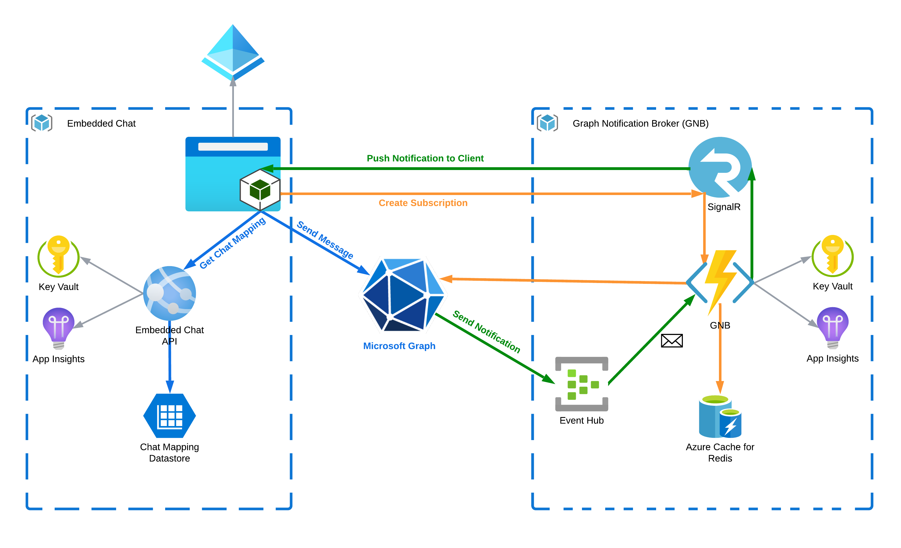
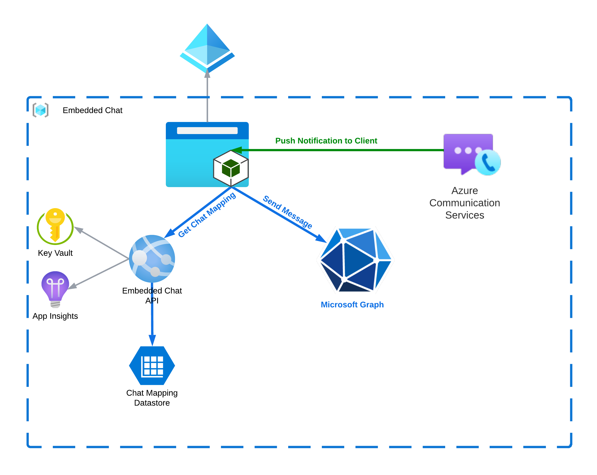

# Overall Architecture

The overall architecture of Embedded Chat is shown in following diagram.

## Embedded Chat with Graph Notification Broker Architecture

## Embedded Chat with Azure Communication Services Architecture

* Any third party web application can use Embedded Chat by referencing the Embedded Chat script and assign it to a div in it's own UI
* While using GNB as a notification source, the Embedded Chat script communicates with:
  * Graph Notification Broker to setup notifications for messages and participants. Embedded chat solution uses GNB to allow retrieval of near real time notifications from Microsoft Graph using SignalR. Documentation and code for Graph Notification Broker can be found at [GNB on GitHub](https://github.com/microsoft/GraphNotificationBroker).
  * Microsoft Graph API to retrieve chats, participants and create chat messages for Teams.
  * Azure AD for user authentication and retrieval of access tokens.

* If ACS is selected as notification source, the embedded Chat script communicates with:
  * Embedded Chat API to query or create entity mappings, create an Online Teams Meeting and/or create an ACS Token. Leveraging [interoperability](https://learn.microsoft.com/en-us/azure/communication-services/concepts/teams-interop#teams-meeting-and-calling-experiences) between Azure Communication Services and Microsoft Teams, the embedded chat solution enables applications and users to participate in Teams meetings and use that for chats. The embedded chat solution subscribes to real-time ACS notifications for chats as well as participants.
  * Microsoft Graph API to retrieve chats, participants and create chat messages for Teams.
  * Azure AD for user authentication and retrieval of access tokens.

Embedded Chat can optionally work with Azure Communication Service or Microsoft Graph as a notification source.
> **Note**
> All usage of Azure Communication Service APIs and SDKs increments [Azure Communication Service billing meters](https://azure.microsoft.com/en-us/pricing/details/communication-services/). Interactions with Microsoft Teams, such as joining a teams meeting, which embedded chat (ACS Notification source) solution leverages will increment these meters.
</em>

## Technical Architecture

All logic for Embedded Chat is consolidated in the Embedded Chat script module "embeddedchat.min.js". This is a plain JavaScript file and can be used in any modern browser.

Embedded Chat can work with two notification sources:

1. Microsoft Graph
1. Azure Communication Service together with Teams Online Meeting.

Depending on the notification source the Embedded Chat script performs a different number of tasks.

For Microsoft Graph these are:

1. Communication with Azure AD for login and retrieval access tokens for Graph Notification Broker and Microsoft Graph
1. Creating or Retrieving Chat information based on an Entity ID in the Azure Table in the Azure Storage Account. If entity ID is new a new entry and a chat on Teams is created with Topic Name as name with the specified participants
1. Create two subscriptions:
    1. A subscription for created, deleted and updated chat messages in the associated Teams Chat
    1. A subscription for added and removed participants
1. Sent a message as new chat message to the Teams Chat
1. Processing incoming notifications for chat message and participants

For Azure Communication Service these are:

1. Communication with Azure AD for login and retrieval access tokens for Azure Communication Services and Microsoft Graph
1. Creating or Retrieving Chat information based on an Entity ID in the Azure Table in the Azure Storage Account. If entity ID is new a new entry and a chat on Teams is created with Entity ID as name with the specified participants
1. Connection with Azure Communication Service bridged to Microsoft Teams Chat to retrieve notification on new chats
1. Sent a message as new chat message to the Teams Chat
1. Processing incoming notifications for chat message and participants

## Security Architecture

EmbeddedChat implements following security:

1. The SignalR, WebAPIs, Microsoft Graph and ACS calls are secured with an oAuth Access Token that is acquired from Azure AD by the user or via an On Behalf Flow with identity of the user. Only delegated permissions are used.
1. Consent is required before access token for the defined permissions can be acquired.
1. Azure Storage is accessed using a connection string including a secret. The EmbeddedChat API uses secrets to communicate with ACS and acquire access token for Graph with OBO Flow. These secrets are stored in Azure Key Vault.
1. Key Vault is accessed from the web app with a managed identity.
1. For interaction with the chat via ACS, ACS access tokens are required. These are acquired with the user identity and stored in the Azure Table.

Communication between the different components of Embedded Chat is via HTTPS traffic. No security means except for AuthN/AuthZ is implemented, but normal network security can be implemented in a production environment to harden the solution. See <https://learn.microsoft.com/en-us/azure/architecture/example-scenario/security/hardened-web-app> for example to harden a web application.

An application registration is made that had the following configuration:

1. Expose an API that users and admins can consent which has "api://<appId>/access_as_user" format
1. The following Azure Communication Service Permissions
    * Teams.ManageCalls
    * Teams.ManageChats
1. The following Microsoft Graph Delegated Permissions
    * openid
    * email
    * offline_access
    * profile
    * User.Read
    * User.ReadBasic.All
    * Chat.ReadWrite
    * OnlineMeetings.ReadWrite
    * People.Read
1. The following permission from the Graph Notification Broker API:
    * api://AppId Graph Notification Broker Backend/Chat.Read

## Sequence Diagrams Graph

### Start Chat

Below sequence diagram is given for both possible notification backends:

1. Graph Notification Broker
1. Azure Communication Service

Called Notification Backend in below diagram.

```mermaid
sequenceDiagram
    autonumber
    Actor User
    participant Third Party App
    participant EmbeddedChat
    participant EmbeddedChat API
    participant Azure Ad
    participant Notification Backend
    User->>Third Party App: Open
    Third Party App->>EmbeddedChat: Load
    User->>EmbeddedChat: Enter EntityID
    EmbeddedChat->>Azure Ad: Sign In & Request Token
    Azure Ad->>User: Login challenge
    User->>Azure Ad: Credentials
    Azure Ad->>Azure Ad: Validate Credentials
    alt On successful login
        EmbeddedChat->>Azure Ad: Request Access Tokens
        Azure Ad->>EmbeddedChat: Access Tokens
        EmbeddedChat->>EmbeddedChat API: Retrieve Mapping
        EmbeddedChat API->>EmbeddedChat API: Validate Token
        alt Valid Token
            EmbeddedChat API->>EmbeddedChat API: Search Mapping on EntityID
            alt Mapping Exists
                EmbeddedChat API->>EmbeddedChat: Return Mapping
            else No Mapping Found
                EmbeddedChat API->>Azure Ad: Acquire Graph Token OBO User
                Azure Ad->>Azure Ad: Validate User Token
                alt Valid User Token
                    Azure Ad->>EmbeddedChat API: Access Token
                    EmbeddedChat API->>Microsoft Graph: Create Teams Chat
                    Microsoft Graph->>EmbeddedChat API: Teams Chat Details
                    EmbeddedChat API->>EmbeddedChat API: Store EntityID/Chat Mapping
                    EmbeddedChat API->>EmbeddedChat: Return EntityID/Chat Mapping
                else Invalid User Token
                    Azure Ad->>EmbeddedChat API: return 401
                    EmbeddedChat API->>EmbeddedChat: Send Exception
                end
            end
        else
            EmbeddedChat API->>EmbeddedChat: return 401
        end
        EmbeddedChat->>Notification Backend: Start Notifications
        EmbeddedChat->>Microsoft Graph: Retrieve chats for Thread
        Microsoft Graph->>EmbeddedChat: List of Chat Messages
        EmbeddedChat->>EmbeddedChat: Render Chats
        EmbeddedChat->>EmbeddedChat: Wait on Notifications
    else Not successful login
        Azure Ad->>EmbeddedChat: return 401
    end
```

### Receive Change Notification

Assuming the sequence before is successful, EmbeddedChat will wait on Change Notification when a event occurs on a chat message or participant. Below sequence diagram is given for both possible notification backends:

1. Graph Notification Broker
1. Azure Communication Service

Called Notification Backend in below diagram.

```mermaid
sequenceDiagram
    autonumber
    Actor User
    participant EmbeddedChat
    participant Notification Backend
    participant Teams Chat
    User->>+Teams Chat: Create update or delete chat messsage
    User->>+Teams Chat: Add or Remove participant
    Teams Chat->>Notification Backend: Change Notifications
    loop every notification
        Notification Backend->>EmbeddedChat: Sent Notification
        alt Message has encrypted Resource Data
            Note over EmbeddedChat,Notification Backend: Only Graph Notification have Resource Data
            EmbeddedChat->>Notification Backend: Decrypt Encrypted Content
            Notification Backend->>Notification Backend: Validate Token
            alt Token Valid
                Notification Backend->>Notification Backend: Decrypt Content
                Notification Backend->>EmbeddedChat: Return Decrypted Content
            else Token InValid
                Notification Backend->>EmbeddedChat:Return 401
            end
        end
        EmbeddedChat->>EmbeddedChat: Update UI with new content
    end
```

### Start Notifications for Notification Backend

For EmbeddedChat there are two notification backends:

1. Graph Notification Broker using Graph Change Notification
1. Azure Communication Service

Both have different method to create notification. In below two section these are described

#### Notification with Graph Notification Broker

```mermaid
sequenceDiagram
    autonumber
    participant EmbeddedChat
    participant EmbeddedChat API
    participant Azure SignalR Service
    participant GNB
    participant GNB
    participant Azure Ad
    participant Microsoft Graph

    loop Every Renewal Timer Trigger
        EmbeddedChat->>GNB: Request Subscriptions
        note over EmbeddedChat, GNB: Requested for Messages & Participants
        GNB->>GNB: Validate Token
        alt Token Valid
            GNB-->Azure Ad: Acquire Graph Token OBO User
            Azure Ad-->GNB: Access Token
            GNB->>Microsoft Graph: Request subscription
            alt successful
                Microsoft Graph->>GNB: Subscription
                GNB->>EmbeddedChat: Subscription Confirmation
                EmbeddedChat->>EmbeddedChat: Store subscription
                EmbeddedChat->>EmbeddedChat: Set Renewal Timer
            else error
                Microsoft Graph->>GNB: Exception
                GNB->>EmbeddedChat: Subscription Failure
            end
        else Token Invalid
            GNB->>EmbeddedChat: Return 401
        end
    end
```

#### Notifications with Azure Communication Service

```mermaid
sequenceDiagram
    participant EmbeddedChat
    participant EmbeddedChatAPI
    participant Azure Ad
    participant ACS
    EmbeddedChat->>EmbeddedChatAPI: Request ACS Token
    EmbeddedChatAPI->>EmbeddedChatAPI: Validate Token
    alt Token Valid
        EmbeddedChatAPI->>ACS: Create ACS Client and get ACS Token
        ACS->>ACS: Validate Token
        alt Token Valid
            ACS->>EmbeddedChatAPI: ACS Token
        end
        EmbeddedChatAPI->>Azure Ad: Acquire Graph Token OBO User
        Azure Ad->>Azure Ad: Validate Token
        alt Token Valid
            Azure Ad->>EmbeddedChatAPI: Graph Access Token
        end
        EmbeddedChatAPI->>ACS: Exchange Graph Token for ACS Token
        ACS->>ACS: Validate Token
        alt Token Valid
            ACS->>EmbeddedChatAPI: ACS Token for User
        end
        EmbeddedChatAPI->>EmbeddedChatAPI: Embed token in ACSInfo
        EmbeddedChatAPI->>EmbeddedChat: Return ACSInfo
        EmbeddedChat->>EmbeddedChatAPI: Update Mapping with ACSInfo
        EmbeddedChatAPI->>EmbeddedChatAPI: Validate Token
        alt Token Valid
            EmbeddedChatAPI->>EmbeddedChatAPI: Store Mapping
            EmbeddedChatAPI->>EmbeddedChat: Return Ok
            EmbeddedChat->>ACS: Create Call Client and Join Call (Teams OnlineMeeting)
            EmbeddedChat->>ACS: Start Listning for notifications.
        else
            EmbeddedChatAPI->>EmbeddedChat: Return 401
        end
    else
        EmbeddedChatAPI->>EmbeddedChat: return 401
    end   
```
